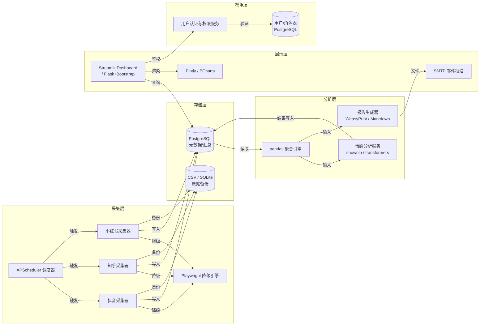
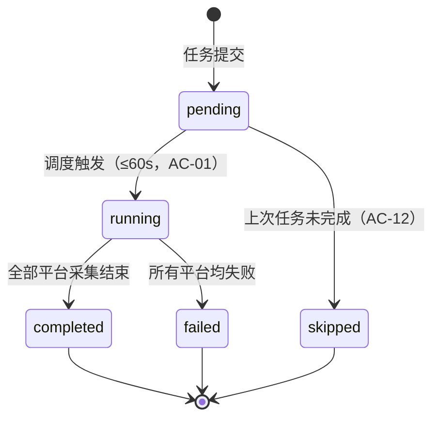

<!-- 同步时间：2026-03-06T03:47:19.651Z | 由 proj.taskstoissues 自动同步 -->
# 技术方案：国内主流社交媒体数据采集与分析平台

**功能分支**：`social-media-collect-analyze`
**创建日期**：2026-03-06
**版本**：v1.0
**PRD 来源**：`specs/social-media-collect-analyze/prd.md`
**负责人**：架构师/Tech Lead

---

## 技术背景

本平台面向内容运营人员、品牌营销分析师和平台管理员，统一采集抖音、知乎、小红书三大平台的公开内容与互动数据，并提供可视化分析、定时调度、权限管理和报告导出能力。

核心技术问题包括：反爬策略应对（Playwright 浏览器自动化 + 请求限速）、中文情感分析（基于 transformers 或 snownlp 的三分类模型）、多平台并行采集的任务编排，以及定时调度的幂等性保证。

**技术栈**：
- 语言：Python 3.11
- 数据采集：requests / httpx（优先）、Playwright（反爬降级）
- 调度：APScheduler（进程内）或系统 cron
- 数据存储：PostgreSQL 16（主库）、SQLite / CSV（原始备份）
- 数据分析：pandas 2.x、jieba（分词）、snownlp / transformers（情感）
- 展示层：Streamlit（Dashboard）或 Flask + Bootstrap + Plotly / ECharts
- 报告导出：WeasyPrint（PDF 生成）、SMTP（邮件投递）

**技术背景 Checklist**：
- [x] 与 PRD 中所有 AC（AC-01 ~ AC-14）逐一对应确认
- [x] 明确使用的技术栈（Python 3.11 / PostgreSQL 16 / Streamlit）
- [x] 明确存储方案（PostgreSQL 主库 + SQLite/CSV 备份）
- [x] 明确部署目标（Docker Compose 单机或云服务器，支持横向扩展）

---

## 架构概览



**架构说明**：
- **调度器（APScheduler）**：管理所有定时/手动采集任务，维护任务锁防止并发重复执行，对应 AC-11、AC-12。
- **平台采集器**：每平台独立模块，优先使用 httpx 异步请求，遇反爬时降级为 Playwright；平台级故障隔离，对应 AC-04。
- **PostgreSQL 主库**：存储产品元数据、任务记录、内容条目、情感分析结果及汇总指标，对应 AC-01、AC-02、AC-05、AC-07、AC-13。
- **CSV / SQLite 备份**：保存每次采集的原始 JSON 响应，用于审计和重放分析。
- **pandas 聚合引擎**：按关键词/平台/时间窗口聚合热度指标，驱动趋势图数据，对应 AC-05、AC-06。
- **情感分析服务**：中文三分类（正面/中性/负面），批量处理，对应 AC-07、AC-08。
- **报告生成器**：从 PostgreSQL 读取汇总数据，生成 PDF 或 Markdown，对应 AC-09、AC-10。
- **Streamlit Dashboard**：前端展示，支持平台/时间筛选，对应 US-02、US-06。
- **用户认证与权限服务**：JWT 无状态认证 + RBAC，对应 AC-14。

---

## 数据模型

### 实体一：用户（User）

| 字段名 | 类型 | 约束 | 说明 |
|---|---|---|---|
| id | UUID | 主键，自动生成 | 唯一标识 |
| username | varchar(64) | 唯一，非空 | 登录名 |
| password_hash | varchar(255) | 非空 | bcrypt 哈希（cost=12） |
| role | varchar(32) | 非空，枚举：admin/analyst/operator/readonly | 角色，驱动 RBAC |
| is_active | boolean | 默认 true | 账号是否启用 |
| created_at | timestamp | 非空，自动生成 | 创建时间 |
| updated_at | timestamp | 非空，自动更新 | 最后更新时间 |

---

### 实体二：采集任务（CollectTask）

| 字段名 | 类型 | 约束 | 说明 |
|---|---|---|---|
| id | UUID | 主键，自动生成 | 唯一标识 |
| keyword | varchar(200) | 非空 | 目标关键词 |
| platforms | varchar[] | 非空，元素枚举：douyin/zhihu/xiaohongshu | 目标平台列表 |
| status | varchar(32) | 非空，枚举：pending/running/completed/failed/skipped | 任务状态 |
| trigger_type | varchar(16) | 非空，枚举：manual/scheduled | 触发类型（对应 AC-11） |
| scheduled_cron | varchar(64) | 可空 | cron 表达式，仅定时任务填写 |
| started_at | timestamp | 可空 | 实际开始时间 |
| completed_at | timestamp | 可空 | 完成时间 |
| total_count | int | 默认 0 | 实际采集条数（对应 AC-02） |
| created_by | UUID | 非空，外键→User.id | 创建人 |
| created_at | timestamp | 非空，自动生成 | 创建时间 |

**任务状态流转**：



---

### 实体三：平台采集结果（PlatformResult）

| 字段名 | 类型 | 约束 | 说明 |
|---|---|---|---|
| id | UUID | 主键，自动生成 | 唯一标识 |
| task_id | UUID | 非空，外键→CollectTask.id | 所属任务 |
| platform | varchar(32) | 非空，枚举：douyin/zhihu/xiaohongshu | 平台标识 |
| status | varchar(32) | 非空，枚举：success/failed | 该平台采集状态（对应 AC-04） |
| fail_reason | text | 可空 | 失败原因描述 |
| count | int | 默认 0 | 该平台实际采集条数 |
| collected_at | timestamp | 非空，自动生成 | 采集完成时间 |

---

### 实体四：内容条目（ContentItem）

| 字段名 | 类型 | 约束 | 说明 |
|---|---|---|---|
| id | UUID | 主键，自动生成 | 唯一标识 |
| platform | varchar(32) | 非空，枚举：douyin/zhihu/xiaohongshu | 来源平台 |
| platform_content_id | varchar(128) | 非空，唯一+platform联合 | 平台侧内容 ID，用于去重 |
| task_id | UUID | 非空，外键→CollectTask.id | 关联任务 |
| keyword | varchar(200) | 非空 | 关键词 |
| title | text | 可空 | 标题（知乎问题/小红书笔记标题） |
| summary | text | 可空 | 摘要/正文前 500 字 |
| author_name | varchar(128) | 可空 | 作者公开名称（不存储个人隐私信息） |
| like_count | int | 默认 0 | 点赞数 |
| comment_count | int | 默认 0 | 评论数 |
| collect_count | int | 默认 0 | 收藏数 |
| interaction_total | int | 生成列：like+comment+collect | 互动量总和（对应 AC-13） |
| published_at | timestamp | 非空 | 内容发布时间 |
| collected_at | timestamp | 非空，自动生成 | 采集入库时间 |

---

### 实体五：情感分析结果（SentimentResult）

| 字段名 | 类型 | 约束 | 说明 |
|---|---|---|---|
| id | UUID | 主键，自动生成 | 唯一标识 |
| content_item_id | UUID | 非空，外键→ContentItem.id | 被分析内容 |
| sentiment | varchar(16) | 非空，枚举：positive/neutral/negative | 情感分类 |
| confidence | float | 非空，范围 [0,1] | 模型置信度 |
| analyzed_at | timestamp | 非空，自动生成 | 分析时间 |

---

### 实体六：热度汇总（TrendSummary）

| 字段名 | 类型 | 约束 | 说明 |
|---|---|---|---|
| id | UUID | 主键，自动生成 | 唯一标识 |
| keyword | varchar(200) | 非空 | 关键词 |
| platform | varchar(32) | 非空，枚举：douyin/zhihu/xiaohongshu/all | 平台（all 表示全平台） |
| date | date | 非空 | 统计日期 |
| content_count | int | 默认 0 | 当日新增内容数 |
| interaction_sum | bigint | 默认 0 | 当日互动量总和 |
| updated_at | timestamp | 非空，自动更新 | 最后更新时间 |

---

## 接口合约（API Contracts）

> 全部接口需携带有效 JWT Token（`Authorization: Bearer <token>`），标注"无需认证"者除外。接口限流默认每用户每分钟 60 次，特殊标注另行说明。

---

### 接口 1：用户登录（US-07，AC-14 前置）

| 属性 | 说明 |
|---|---|
| 路径 | `POST /api/auth/login` |
| 认证 | 无需认证 |
| 限流 | 每 IP 每分钟 10 次 |

**请求体**：
```json
{
  "username": "operator01",
  "password": "明文密码"
}
```

**成功响应（200）**：
```json
{
  "token": "eyJhbGciOiJIUzI1NiIsInR5cCI6IkpXVCJ9...",
  "expires_at": "2026-03-07T02:30:00Z",
  "user_id": "550e8400-e29b-41d4-a716-446655440000",
  "role": "operator"
}
```

**错误响应**：
| HTTP 状态码 | 错误码 | 说明 |
|---|---|---|
| 401 | AUTH_INVALID | 用户名或密码错误 |
| 403 | AUTH_INACTIVE | 账号已停用 |
| 429 | AUTH_RATE_LIMIT | 请求频率超限 |

---

### 接口 2：创建采集任务（US-01，AC-01 ~ AC-04）

| 属性 | 说明 |
|---|---|
| 路径 | `POST /api/tasks` |
| 认证 | 需要 JWT，角色：operator 或 admin |
| 限流 | 每用户每分钟 20 次 |

**请求体**：
```json
{
  "keyword": "露营",
  "platforms": ["douyin", "zhihu", "xiaohongshu"],
  "trigger_type": "manual"
}
```

**成功响应（202 Accepted）**：
```json
{
  "task_id": "7b44e3b0-1234-5678-abcd-000000000001",
  "status": "pending",
  "keyword": "露营",
  "platforms": ["douyin", "zhihu", "xiaohongshu"],
  "message": "任务已提交，将在 60 秒内开始执行"
}
```

**错误响应**：
| HTTP 状态码 | 错误码 | 说明 |
|---|---|---|
| 400 | KEYWORD_FORBIDDEN | 关键词含违禁内容，任务未创建（AC-03） |
| 400 | PLATFORM_INVALID | 平台参数不合法 |
| 403 | PERMISSION_DENIED | 权限不足（AC-14） |
| 422 | KEYWORD_EMPTY | 关键词不能为空 |

---

### 接口 3：查询任务详情（US-01，AC-01 ~ AC-04）

| 属性 | 说明 |
|---|---|
| 路径 | `GET /api/tasks/{task_id}` |
| 认证 | 需要 JWT |
| 限流 | 默认 |

**成功响应（200）**：
```json
{
  "task_id": "7b44e3b0-1234-5678-abcd-000000000001",
  "keyword": "露营",
  "status": "completed",
  "trigger_type": "manual",
  "total_count": 312,
  "platform_results": [
    {
      "platform": "douyin",
      "status": "success",
      "count": 150
    },
    {
      "platform": "zhihu",
      "status": "success",
      "count": 98
    },
    {
      "platform": "xiaohongshu",
      "status": "failed",
      "fail_reason": "平台响应超时，已重试 3 次"
    }
  ],
  "started_at": "2026-03-06T02:30:45Z",
  "completed_at": "2026-03-06T02:32:10Z"
}
```

**错误响应**：
| HTTP 状态码 | 错误码 | 说明 |
|---|---|---|
| 404 | TASK_NOT_FOUND | 任务不存在 |
| 403 | PERMISSION_DENIED | 无权查看他人任务 |

---

### 接口 4：配置定时采集任务（US-05，AC-11 ~ AC-12）

| 属性 | 说明 |
|---|---|
| 路径 | `POST /api/tasks/scheduled` |
| 认证 | 需要 JWT，角色：operator 或 admin |
| 限流 | 每用户每分钟 10 次 |

**请求体**：
```json
{
  "keyword": "露营",
  "platforms": ["douyin", "zhihu", "xiaohongshu"],
  "scheduled_cron": "0 8 * * *"
}
```

**成功响应（201 Created）**：
```json
{
  "schedule_id": "sched-0001",
  "keyword": "露营",
  "scheduled_cron": "0 8 * * *",
  "next_run_at": "2026-03-07T08:00:00+08:00",
  "message": "定时任务已创建，将于次日 08:00 自动执行"
}
```

**错误响应**：
| HTTP 状态码 | 错误码 | 说明 |
|---|---|---|
| 400 | CRON_INVALID | cron 表达式格式错误 |
| 409 | SCHEDULE_CONFLICT | 同关键词已存在运行中的同一 cron 任务 |
| 403 | PERMISSION_DENIED | 权限不足 |

---

### 接口 5：获取内容热度趋势（US-02，AC-05 ~ AC-06）

| 属性 | 说明 |
|---|---|
| 路径 | `GET /api/analysis/trend` |
| 认证 | 需要 JWT |
| 限流 | 默认 |

**请求参数（Query String）**：
```
keyword=露营&platforms=douyin,zhihu&date_from=2026-02-04&date_to=2026-03-06
```

**成功响应（200）**：
```json
{
  "keyword": "露营",
  "date_from": "2026-02-04",
  "date_to": "2026-03-06",
  "actual_date_from": "2026-03-04",
  "data_coverage_days": 2,
  "coverage_warning": "当前数据覆盖 2 天，结果仅供参考",
  "series": [
    {
      "platform": "douyin",
      "data": [
        {"date": "2026-03-04", "content_count": 45, "interaction_sum": 12300},
        {"date": "2026-03-05", "content_count": 67, "interaction_sum": 19800}
      ]
    },
    {
      "platform": "zhihu",
      "data": [
        {"date": "2026-03-04", "content_count": 12, "interaction_sum": 3400},
        {"date": "2026-03-05", "content_count": 18, "interaction_sum": 5100}
      ]
    }
  ]
}
```

**错误响应**：
| HTTP 状态码 | 错误码 | 说明 |
|---|---|---|
| 400 | DATE_RANGE_INVALID | 日期范围格式错误或 from > to |
| 404 | NO_DATA | 该关键词无任何数据 |

---

### 接口 6：执行情感分析（US-03，AC-07 ~ AC-08）

| 属性 | 说明 |
|---|---|
| 路径 | `POST /api/analysis/sentiment` |
| 认证 | 需要 JWT |
| 限流 | 每用户每分钟 5 次（分析较重） |

**请求体**：
```json
{
  "keyword": "某品牌",
  "platforms": ["douyin", "zhihu", "xiaohongshu"],
  "date_from": "2026-02-05",
  "date_to": "2026-03-06"
}
```

**成功响应（200）**：
```json
{
  "keyword": "某品牌",
  "total_analyzed": 312,
  "low_confidence_warning": null,
  "distribution": {
    "positive": {"count": 187, "ratio": 0.60},
    "neutral":  {"count": 94,  "ratio": 0.30},
    "negative": {"count": 31,  "ratio": 0.10}
  },
  "samples": {
    "positive": [
      {"content_id": "uuid-001", "title": "露营装备推荐", "summary": "这款帐篷真的超好用..."},
      {"content_id": "uuid-002", "title": "周末亲子露营", "summary": "孩子玩得很开心..."},
      {"content_id": "uuid-003", "title": "露营新手指南", "summary": "强烈推荐新手入手..."}
    ],
    "neutral": [
      {"content_id": "uuid-010", "title": "露营地点对比", "summary": "各有优缺点..."},
      {"content_id": "uuid-011", "title": "露营费用清单", "summary": "整体花费适中..."},
      {"content_id": "uuid-012", "title": "露营天气注意事项", "summary": "需要提前查天气..."}
    ],
    "negative": [
      {"content_id": "uuid-020", "title": "踩坑记录", "summary": "装备质量太差了..."},
      {"content_id": "uuid-021", "title": "露营营地差评", "summary": "卫生条件很糟糕..."},
      {"content_id": "uuid-022", "title": "虚假宣传投诉", "summary": "和图片完全不符..."}
    ]
  },
  "analyzed_at": "2026-03-06T02:31:00Z"
}
```

**数据不足响应（200 + 警告）**：
```json
{
  "keyword": "某品牌",
  "total_analyzed": 15,
  "low_confidence_warning": "数据量不足（15 条 < 20 条），分析结果置信度较低",
  "distribution": { ... }
}
```

**错误响应**：
| HTTP 状态码 | 错误码 | 说明 |
|---|---|---|
| 404 | NO_DATA | 该关键词无任何数据 |
| 429 | RATE_LIMIT | 分析请求频率超限 |
| 503 | SENTIMENT_SERVICE_UNAVAILABLE | 情感分析服务暂时不可用 |

---

### 接口 7：导出分析报告（US-04，AC-09 ~ AC-10）

| 属性 | 说明 |
|---|---|
| 路径 | `POST /api/reports/export` |
| 认证 | 需要 JWT |
| 限流 | 每用户每分钟 3 次 |

**请求体**：
```json
{
  "keyword": "露营",
  "platforms": ["douyin", "zhihu", "xiaohongshu"],
  "date_from": "2026-02-05",
  "date_to": "2026-03-06",
  "format": "pdf"
}
```

**成功响应（200）**：
```json
{
  "report_id": "rpt-20260306-001",
  "download_url": "/api/reports/rpt-20260306-001/download",
  "expires_at": "2026-03-07T02:30:00Z",
  "format": "pdf",
  "generated_at": "2026-03-06T02:31:15Z"
}
```

**错误响应**：
| HTTP 状态码 | 错误码 | 说明 |
|---|---|---|
| 400 | FORMAT_UNSUPPORTED | 不支持的导出格式 |
| 422 | NO_ANALYSIS_DATA | 无可导出分析数据，导出被阻止（AC-10） |
| 503 | REPORT_SERVICE_UNAVAILABLE | 报告生成服务不可用 |

---

### 接口 8：热门内容榜单（US-06，AC-13）

| 属性 | 说明 |
|---|---|
| 路径 | `GET /api/leaderboard` |
| 认证 | 需要 JWT |
| 限流 | 默认 |

**请求参数（Query String）**：
```
platform=xiaohongshu&hours=24&limit=50
```

**成功响应（200）**：
```json
{
  "platform": "xiaohongshu",
  "hours": 24,
  "total": 50,
  "items": [
    {
      "content_id": "uuid-100",
      "title": "超治愈露营 vlog",
      "summary": "带你看最美星空下的帐篷...",
      "author_name": "户外达人小明",
      "like_count": 45230,
      "comment_count": 3120,
      "collect_count": 12800,
      "interaction_total": 61150,
      "published_at": "2026-03-05T18:30:00Z"
    }
  ]
}
```

**错误响应**：
| HTTP 状态码 | 错误码 | 说明 |
|---|---|---|
| 400 | PLATFORM_INVALID | 平台参数不合法 |
| 404 | NO_DATA | 该平台最近指定时间内无数据 |

---

### 接口 9：用户权限管理（US-07，AC-14）

| 属性 | 说明 |
|---|---|
| 路径 | `PATCH /api/admin/users/{user_id}/role` |
| 认证 | 需要 JWT，角色：admin |
| 限流 | 每用户每分钟 20 次 |

**请求体**：
```json
{
  "role": "readonly"
}
```

**成功响应（200）**：
```json
{
  "user_id": "550e8400-e29b-41d4-a716-446655440099",
  "username": "analyst02",
  "role": "readonly",
  "updated_at": "2026-03-06T02:30:00Z"
}
```

**错误响应**：
| HTTP 状态码 | 错误码 | 说明 |
|---|---|---|
| 400 | ROLE_INVALID | 角色值不合法 |
| 403 | PERMISSION_DENIED | 非管理员无权修改角色 |
| 404 | USER_NOT_FOUND | 用户不存在 |

---

## 架构决策记录（ADR）

### ADR-01：数据采集引擎选型

| 属性 | 说明 |
|---|---|
| **决策** | 优先使用 httpx 异步 HTTP 客户端，遇反爬时自动降级为 Playwright |
| **背景** | 抖音、小红书等平台对机器请求有不同程度的反爬措施；httpx 性能高但无法执行 JavaScript；Playwright 可模拟真实浏览器但资源消耗大（每实例约 150MB 内存） |
| **备选方案** | ①纯 requests 同步请求（简单但性能低、无 JS 执行能力）；②纯 Playwright（通用性强但资源占用高、部署复杂）；③第三方数据服务 API（成本高、依赖外部）|
| **决策理由** | httpx+降级 Playwright 兼顾性能与可靠性：正常情况下 httpx 处理 90%+ 请求，仅在检测到反爬（状态码 403/412/验证码页面）时切换 Playwright，降低整体资源消耗 |
| **权衡取舍** | 增加了降级逻辑的复杂度；Playwright 实例池需要预热时间（约 3~5 秒），可能影响首次降级的响应速度 |

---

### ADR-02：情感分析模型选型

| 属性 | 说明 |
|---|---|
| **决策** | MVP 阶段使用 snownlp（规则+统计模型），后续可升级为 transformers（chinese-roberta-wwm-ext）|
| **背景** | 中文情感分析需要中文专用模型；系统需在 30 秒内完成 100 条内容的批量分析（AC-07） |
| **备选方案** | ①snownlp（轻量，无 GPU 依赖，精度约 75%）；②transformers 预训练模型（精度约 88%，需 GPU 或 4 核 CPU 8GB 内存）；③调用第三方情感 API（百度/腾讯，精度高但有费用和网络依赖）|
| **决策理由** | snownlp 无硬件依赖，可在普通服务器上满足 30 秒/100 条的性能要求；transformers 精度更高但 MVP 阶段硬件资源未确定；通过接口抽象，可在后续版本无缝替换模型 |
| **权衡取舍** | snownlp 对口语化社交媒体文本的分类精度相对较低（约 70~75%），特别是反讽和混合情感场景；已通过 AC-08 的置信度警告机制缓解用户预期 |

---

### ADR-03：展示层框架选型

| 属性 | 说明 |
|---|---|
| **决策** | 使用 Streamlit 作为 MVP 展示层 |
| **背景** | 团队以 Python 为主，需要快速交付可交互的数据仪表盘；前端开发资源有限 |
| **备选方案** | ①Streamlit（纯 Python，开发速度快，适合数据展示，但定制化能力有限）；②Flask + Bootstrap + Plotly（灵活但需要前后端分离开发，周期较长）；③Grafana（适合运维指标，数据接入成本高）|
| **决策理由** | Streamlit 允许 Python 开发者在无前端知识的情况下快速构建交互式仪表盘；通过 Plotly 集成可满足折线图、饼图等展示需求；MVP 上线后如需定制化可迁移至 Flask |
| **权衡取舍** | Streamlit 并发支持较弱（单进程模型，高并发需配合多进程部署）；UI 定制能力不及 Flask；已规划 v2 版本通过 Flask 重写展示层 |

---

## 技术风险

| 风险 | 可能性 | 影响 | 缓解措施 |
|---|---|---|---|
| 🔴 目标平台反爬升级，采集频繁失败 | 高 | 高——核心采集能力受损，直接影响 AC-01、AC-04 | 维护 User-Agent 池和请求间隔随机化；建立 Playwright 降级兜底；实现平台级故障检测与告警，问题平台自动跳过并通知管理员 |
| 🔴 情感分析 30 秒内无法完成 100 条（AC-07 性能要求） | 高 | 中——影响分析用户体验，可降级提示 | 对分析任务使用异步队列（Celery + Redis）；前端展示进度条；限流每用户每分钟 5 次防止并发积压 |
| 🟠 PostgreSQL 单点故障导致服务不可用 | 中 | 高 | 配置 PostgreSQL 流复制（主从）；应用层实现连接池（pgbouncer）；关键查询加超时限制，降级返回 CSV 备份数据 |
| 🟠 PDF 生成超过 30 秒（AC-09） | 中 | 中 | 将 PDF 生成异步化，提交后立即返回任务 ID，轮询或 SSE 通知下载链接；使用 WeasyPrint 并行渲染；对图表使用预渲染缓存 |
| 🟡 采集内容触碰违禁词/违规数据合规风险 | 低 | 高 | 采集前关键词过滤（违禁词库）；内容入库时基于正则+关键词过滤敏感字段；按《网安法》《数据安全法》制定数据保留策略（默认保留 180 天后脱敏/删除） |
| 🟡 JWT 密钥泄露导致越权访问 | 低 | 高 | 密钥存入环境变量或 Vault，不入代码库；Token 有效期设置 24 小时；关键操作（角色变更）记录审计日志 |

---

## 实施阶段建议

| 阶段 | 内容 | 对应用户故事 | 建议顺序 |
|---|---|---|---|
| 阶段一：基础设施 | PostgreSQL Schema 初始化、用户认证服务（JWT + RBAC）、Docker Compose 本地环境 | US-07（前置依赖） | 最先 |
| 阶段二：核心采集 | httpx/Playwright 采集器（抖音、知乎、小红书）、任务状态机、违禁词过滤、原始数据入库 | US-01（P1） | 第二 |
| 阶段三：核心分析 | pandas 趋势聚合、TrendSummary 填充、情感分析（snownlp）、分析结果入库 | US-02、US-03（P1） | 第三 |
| 阶段四：展示与定时 | Streamlit Dashboard（趋势图、情感饼图、榜单）、APScheduler 定时任务、任务跳过逻辑 | US-05、US-06（P2） | 第四 |
| 阶段五：报告导出 | PDF 生成（WeasyPrint）、异步导出任务队列、下载接口、SMTP 邮件投递 | US-04（P2） | 第五 |
| 阶段六：收尾 | 集成测试、性能压测（趋势图 5 秒/情感分析 30 秒）、安全审查、文档 | 全部 AC | 最后 |

---

## 非功能需求验证

| 约束 | 来自 PRD | 技术方案 |
|---|---|---|
| 任务 60 秒内开始执行 | AC-01 | APScheduler 轮询间隔设置为 10 秒；任务入库后立即触发，pending→running 延迟 ≤10 秒 |
| 采集条数误差 ≤5% | AC-02 | 采集结束后统计 ContentItem 实际入库数（去重后），与平台返回的 total 字段比对并记录差值 |
| 趋势图 5 秒内渲染 | AC-05 | TrendSummary 聚合表预计算每日数据；查询加索引（keyword + platform + date）；前端直接展示预聚合结果 |
| 情感分析 30 秒内完成（≥100 条） | AC-07 | snownlp 批量处理 100 条约 2~5 秒（CPU）；transformers 约 10~25 秒（4 核）；均满足要求；超时时返回已完成部分 + 502 警告 |
| PDF 导出 30 秒内完成 | AC-09 | 异步任务队列处理；WeasyPrint 生成 A4 PDF 约 5~15 秒；预先缓存图表图片；超时上限 29 秒，超时返回 503 |
| 仅采集公开内容，不存储个人隐私 | 约束 | ContentItem 不含手机号、身份证、邮箱等字段；author_name 仅存储公开展示的账号名称；数据入库前执行 PII 检测正则过滤 |
| 采集频率合理，不造成异常流量 | 约束 | 每平台请求间隔随机 2~8 秒；每任务并发请求数 ≤3；全天每平台采集请求总量上限可配置（默认 10000 次/天） |
| 中文内容处理与展示 | 约束 | 全链路 UTF-8 编码；PostgreSQL 使用 `zh_CN.UTF-8` collation；情感分析模型专为中文优化（snownlp/chinese-roberta） |
| 遵守网安法/数据安全法 | 约束 | 数据默认保留 180 天；到期自动匿名化处理；所有数据访问记录审计日志；禁止将数据对外接口暴露 |
| 权限只读用户无法创建/修改任务 | AC-14 | API 层中间件校验 JWT 中的 role 字段；readonly 角色对 POST/PATCH/DELETE 请求一律返回 403 PERMISSION_DENIED |
