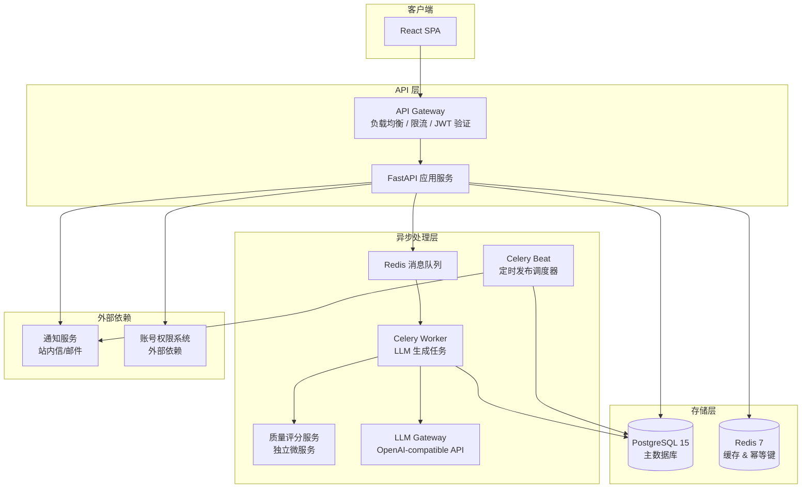
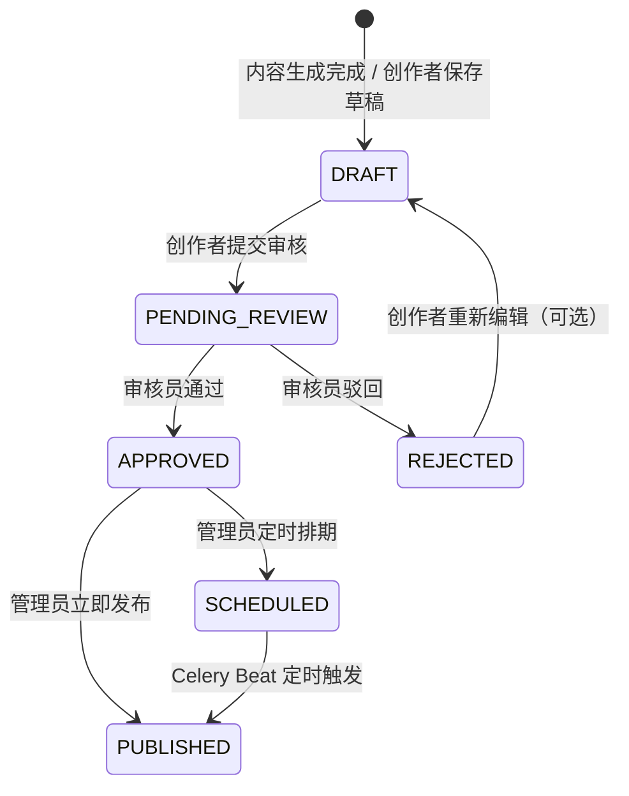

# 技术方案：AI 内容生成与管理平台

**功能分支**：`ai-content-generation`
**创建日期**：2026-04-14
**版本**：v1.0
**PRD 来源**：`specs/ai-content-generation/prd.md`
**负责人**：架构师 / Tech Lead

---

## 技术背景

AI 内容生成与管理平台是面向内容团队的一站式内容生产工具，负责将用户输入的主题/关键词通过大语言模型（LLM）自动生成文章、图文、短视频脚本等多种形式的内容草稿，并贯穿从生成 → 评分 → 审核 → 发布的完整内容生命周期管理。核心技术挑战在于：**异步 LLM 生成任务的超时控制**、**内容状态机的完整性与可审计性**、**定时发布的调度精度**，以及**批量任务的并发控制**。

**技术栈**：
- 后端：Python 3.11 + FastAPI 0.111（异步友好，原生支持 SSE/WebSocket，适合 LLM 流式输出）
- 前端：React 18 + TypeScript（SPA，与后端 REST API 对接）
- 主数据库：PostgreSQL 15（关系型，满足事务性状态流转与可审计需求）
- 缓存 / 消息队列：Redis 7（任务队列、幂等去重 key、限流计数器）
- 异步任务调度：Celery 5 + Celery Beat（处理 LLM 生成任务 & 定时发布调度）
- LLM 接入：OpenAI-compatible API（通过统一 LLM Gateway 适配，支持后续替换模型）
- 通知服务：依赖现有平台通知服务（站内信 / 邮件），通过内部 HTTP 接口调用
- 部署目标：容器化（Docker + Kubernetes），各服务独立扩缩容

**技术背景 Checklist**：
- [x] 与 PRD 中所有 18 条 AC 逐一对应确认（见下方 AC 覆盖矩阵）
- [x] 明确使用的技术栈（Python 3.11 / FastAPI / React 18 / PostgreSQL 15）
- [x] 明确存储方案（PostgreSQL 主库 + Redis 缓存/队列）
- [x] 明确部署目标（Docker + Kubernetes 容器化）

**AC 覆盖矩阵**：

| AC ID | 验收标准摘要 | 对应技术方案章节 |
|---|---|---|
| AC-01 | 文章生成 60 秒内返回 ≥500 字草稿 | 接口 1 + 异步任务 + 超时控制 |
| AC-02 | 主题为空时拒绝提交并提示错误 | 接口 1 请求体校验（FastAPI Pydantic）|
| AC-03 | 超过 60 秒展示超时提示及重试入口 | 任务状态轮询接口 + 超时标记机制 |
| AC-04 | 图文生成 60 秒内返回 100-300 字正文及配图描述 | 接口 2 + LLM Prompt 工程 |
| AC-05 | 未选风格时使用默认风格并标注 | 接口 2 请求体默认值 + 响应字段 |
| AC-06 | 短视频脚本含开场/分镜/CTA，时长误差 ≤10 秒 | 接口 3 + 脚本结构化解析 |
| AC-07 | 时长超出 15/30/60 范围时拒绝提交 | 接口 3 枚举校验（Pydantic Enum）|
| AC-08 | 审核通过后状态变"已审核"，记录时间戳和审核人 | 接口 5 + ReviewRecord 实体 |
| AC-09 | 驳回需填 ≥5 字原因，创建人收到含原因通知 | 接口 6 + 通知服务调用 |
| AC-10 | 质量评分展示 0-100 整数及 ≥2 条评分依据 | QualityScore 实体 + 接口 1/2/3 响应 |
| AC-11 | 评分服务不可用时草稿正常展示，评分区域显示"暂无评分" | 评分服务降级设计（try/except + null 字段）|
| AC-12 | 立即发布时间戳误差 ≤1 分钟 | 接口 7 同步写库 |
| AC-13 | 定时发布误差 ≤5 分钟 | Celery Beat 调度 + 接口 8 |
| AC-14 | 非"已审核"内容拒绝发布并提示 | 接口 7/8 前置状态检查 |
| AC-15 | 退出登录再登录草稿仍可访问 | Content 实体持久化 + 用户 ID 绑定 |
| AC-16 | 草稿提交审核后状态变"待审核"并进入审核队列 | 接口 10 + 状态机 |
| AC-17 | 批量生成最多 20 条，超出拒绝提交 | 接口 11 数组长度校验 |
| AC-18 | 生成内容不含用户个人隐私信息 | LLM Prompt 安全约束 + 输出过滤器 |

---

## 架构概览



**架构说明**：

- **API Gateway**：负责 JWT 认证、请求限流（每用户/IP）、路由转发
- **FastAPI 应用服务**：处理同步 REST 请求，进行参数校验、状态机转换、触发异步任务
- **Celery Worker**：异步执行 LLM 内容生成任务（避免请求阻塞），完成后回写 PostgreSQL
- **Celery Beat**：定时扫描"待发布"内容，在设定时间到达时触发发布状态更新
- **质量评分服务**：独立微服务，对生成内容进行评分；与主流程解耦，不可用时不阻断主流程
- **LLM Gateway**：统一封装 LLM API 调用，支持超时控制、重试、模型切换
- **PostgreSQL**：存储所有内容实体、审核记录、发布记录，保证事务性和可审计性
- **Redis**：存储 Celery 任务队列、幂等去重 key、API 限流计数器
- **通知服务**：接收驳回通知请求，异步发送站内信/邮件（不阻断主流程）

---

## 数据模型

### 实体一：Content（内容主表）

| 字段名 | 类型 | 约束 | 说明 |
|---|---|---|---|
| id | UUID | 主键，自动生成 | 内容唯一标识 |
| type | varchar(20) | 非空，枚举：ARTICLE / IMAGE_TEXT / VIDEO_SCRIPT | 内容类型 |
| title | varchar(500) | 可空 | 内容标题（生成后填充） |
| body | text | 可空 | 正文内容（生成后填充） |
| metadata | jsonb | 可空 | 类型专属扩展字段（见下方说明） |
| status | varchar(20) | 非空，枚举：DRAFT / PENDING_REVIEW / APPROVED / REJECTED / SCHEDULED / PUBLISHED | 内容状态 |
| creator_id | UUID | 非空，外键→用户系统 | 创建人 ID |
| created_at | timestamp | 非空，自动生成（UTC） | 创建时间 |
| updated_at | timestamp | 非空，自动更新（UTC） | 最后更新时间 |
| published_at | timestamp | 可空 | 实际发布时间 |
| scheduled_at | timestamp | 可空 | 定时发布目标时间 |
| generation_task_id | UUID | 可空，外键→ContentGenerationTask | 关联生成任务 |
| batch_job_id | UUID | 可空，外键→BatchGenerationJob | 关联批量任务（如适用） |

**metadata jsonb 结构说明**（按内容类型）：
- ARTICLE：`{"keywords": ["关键词1", ...], "word_count": 520}`
- IMAGE_TEXT：`{"style": "活泼|专业|极简|默认", "image_descriptions": ["描述1", ...]}`
- VIDEO_SCRIPT：`{"target_duration": 30, "scenes": [{"duration": 10, "visual": "...", "voiceover": "..."}], "cta": "..."}`

**状态流转**：



---

### 实体二：ContentGenerationTask（生成任务）

| 字段名 | 类型 | 约束 | 说明 |
|---|---|---|---|
| id | UUID | 主键，自动生成 | 任务唯一标识 |
| content_id | UUID | 可空，外键→Content | 生成成功后关联内容 ID |
| type | varchar(20) | 非空，枚举：ARTICLE / IMAGE_TEXT / VIDEO_SCRIPT | 内容类型 |
| input_params | jsonb | 非空 | 生成输入参数（主题、关键词、风格等） |
| status | varchar(20) | 非空，枚举：PENDING / RUNNING / COMPLETED / FAILED / TIMEOUT | 任务状态 |
| celery_task_id | varchar(255) | 可空 | Celery 任务 ID（用于状态跟踪） |
| error_message | text | 可空 | 失败/超时时的错误信息 |
| creator_id | UUID | 非空 | 发起人 ID |
| created_at | timestamp | 非空，自动生成（UTC） | 创建时间 |
| completed_at | timestamp | 可空 | 完成时间 |
| timeout_at | timestamp | 非空 | 超时时间（created_at + 60s） |

---

### 实体三：ReviewRecord（审核记录）

| 字段名 | 类型 | 约束 | 说明 |
|---|---|---|---|
| id | UUID | 主键，自动生成 | 记录唯一标识 |
| content_id | UUID | 非空，外键→Content | 被审核内容 ID |
| reviewer_id | UUID | 非空，外键→用户系统 | 审核员 ID |
| action | varchar(10) | 非空，枚举：APPROVE / REJECT | 审核操作 |
| reject_reason | varchar(2000) | 仅驳回时非空，且 length ≥ 5 | 驳回原因 |
| reviewed_at | timestamp | 非空，精确到秒（UTC） | 审核时间戳 |
| created_at | timestamp | 非空，自动生成（UTC） | 记录创建时间 |

> 保留周期：审核记录保存不少于 90 天（通过数据库归档策略实现，满足 AC-09 及合规约束）

---

### 实体四：QualityScore（质量评分）

| 字段名 | 类型 | 约束 | 说明 |
|---|---|---|---|
| id | UUID | 主键，自动生成 | 评分记录唯一标识 |
| content_id | UUID | 非空，唯一，外键→Content | 关联内容 ID（一对一） |
| score | smallint | 非空，范围 0-100 | 综合质量分 |
| dimensions | jsonb | 非空，数组长度 ≥ 2 | 评分维度及说明（见下方结构） |
| scored_at | timestamp | 非空，自动生成（UTC） | 评分生成时间 |

**dimensions jsonb 结构示例**：
```json
[
  {"dimension": "结构完整性", "score": 85, "comment": "文章具备标题、引言、正文、结尾四段结构"},
  {"dimension": "关键词覆盖率", "score": 72, "comment": "3 个关键词中 2 个出现在正文中"}
]
```

---

### 实体五：BatchGenerationJob（批量生成任务）

| 字段名 | 类型 | 约束 | 说明 |
|---|---|---|---|
| id | UUID | 主键，自动生成 | 批量任务唯一标识 |
| creator_id | UUID | 非空 | 发起人 ID |
| type | varchar(20) | 非空，枚举（同内容类型） | 批量生成内容类型 |
| topics | jsonb | 非空，数组，长度 1-20 | 提交的主题列表（AC-17 限制最多 20 条）|
| total_count | smallint | 非空 | 总任务数 |
| completed_count | smallint | 非空，默认 0 | 已完成数 |
| failed_count | smallint | 非空，默认 0 | 失败数 |
| status | varchar(20) | 非空，枚举：PENDING / RUNNING / COMPLETED / PARTIAL_FAILED | 批量任务整体状态 |
| created_at | timestamp | 非空，自动生成（UTC） | 创建时间 |
| completed_at | timestamp | 可空 | 全部完成时间 |

---

## 接口合约（API Contracts）

> 所有接口均需通过 API Gateway 进行 JWT 认证，token 由已有账号权限系统签发。角色权限说明：
> - `creator`（内容创作者）：内容生成、草稿管理
> - `reviewer`（审核员）：审核操作
> - `operator`（内容运营管理员）：发布管理、批量生成

---

### 接口 1：触发内容生成

| 属性 | 说明 |
|---|---|
| 路径 | `POST /api/v1/contents/generate` |
| 认证 | JWT，角色：creator / operator |
| 限流 | 每用户每分钟 10 次 |

**请求体**：
```json
{
  "type": "ARTICLE",
  "topic": "人工智能在医疗领域的应用",
  "keywords": ["AI诊断", "医学影像", "辅助决策"],
  "style": null,
  "target_duration": null
}
```
> `type` 枚举：`ARTICLE` / `IMAGE_TEXT` / `VIDEO_SCRIPT`；`topic` 必填；`style` 仅图文有效；`target_duration` 仅短视频脚本有效（枚举：15 / 30 / 60）

**成功响应（202 Accepted）**：
```json
{
  "task_id": "550e8400-e29b-41d4-a716-446655440000",
  "status": "PENDING",
  "timeout_at": "2026-04-14T07:13:44Z",
  "poll_url": "/api/v1/contents/tasks/550e8400-e29b-41d4-a716-446655440000"
}
```

**错误响应**：
| HTTP 状态码 | 错误码 | 说明 |
|---|---|---|
| 422 | VALIDATION_ERROR | 请求体校验失败（如 topic 为空、type 非法） |
| 422 | INVALID_DURATION | target_duration 不在 15/30/60 范围内（AC-07）|
| 429 | RATE_LIMIT_EXCEEDED | 触发限流 |
| 403 | FORBIDDEN | 角色无权限 |

---

### 接口 2：查询生成任务状态

| 属性 | 说明 |
|---|---|
| 路径 | `GET /api/v1/contents/tasks/{task_id}` |
| 认证 | JWT，角色：creator / operator |
| 限流 | 每用户每分钟 60 次（轮询友好） |

**成功响应（200）- 任务完成**：
```json
{
  "task_id": "550e8400-e29b-41d4-a716-446655440000",
  "status": "COMPLETED",
  "content_id": "7f3e4a1b-...",
  "content": {
    "id": "7f3e4a1b-...",
    "type": "ARTICLE",
    "title": "AI 在医疗领域的革命性应用",
    "body": "...(正文 ≥500 字)...",
    "metadata": {"keywords": ["AI诊断"], "word_count": 523},
    "status": "DRAFT",
    "quality_score": {
      "score": 82,
      "dimensions": [
        {"dimension": "结构完整性", "score": 88, "comment": "文章结构完整"},
        {"dimension": "关键词覆盖率", "score": 76, "comment": "关键词覆盖良好"}
      ]
    },
    "created_at": "2026-04-14T07:12:50Z"
  }
}
```

**成功响应（200）- 任务超时**：
```json
{
  "task_id": "550e8400-...",
  "status": "TIMEOUT",
  "error_message": "内容生成超时，请重试",
  "retry_url": "/api/v1/contents/generate"
}
```

**成功响应（200）- 质量评分服务不可用（AC-11）**：
```json
{
  "task_id": "...",
  "status": "COMPLETED",
  "content_id": "...",
  "content": {
    "quality_score": null,
    "quality_score_unavailable": true
  }
}
```

**错误响应**：
| HTTP 状态码 | 错误码 | 说明 |
|---|---|---|
| 404 | TASK_NOT_FOUND | 任务 ID 不存在 |
| 403 | FORBIDDEN | 非任务发起人访问 |

---

### 接口 3：保存草稿

| 属性 | 说明 |
|---|---|
| 路径 | `PUT /api/v1/contents/{content_id}/draft` |
| 认证 | JWT，角色：creator |
| 限流 | 每用户每分钟 30 次 |

**请求体**：
```json
{
  "title": "AI 在医疗领域的革命性应用（修改版）",
  "body": "...(修改后正文)..."
}
```

**成功响应（200）**：
```json
{
  "id": "7f3e4a1b-...",
  "status": "DRAFT",
  "updated_at": "2026-04-14T07:15:00Z"
}
```

**错误响应**：
| HTTP 状态码 | 错误码 | 说明 |
|---|---|---|
| 404 | CONTENT_NOT_FOUND | 内容不存在 |
| 403 | FORBIDDEN | 非内容创建人或角色不符 |
| 409 | INVALID_STATUS | 内容状态不允许编辑（非 DRAFT / REJECTED）|

---

### 接口 4：获取草稿列表

| 属性 | 说明 |
|---|---|
| 路径 | `GET /api/v1/contents?status=DRAFT&page=1&page_size=20` |
| 认证 | JWT，角色：creator（仅查自己）/ operator（可查所有） |
| 限流 | 每用户每分钟 30 次 |

**成功响应（200）**：
```json
{
  "total": 5,
  "page": 1,
  "page_size": 20,
  "items": [
    {
      "id": "7f3e4a1b-...",
      "type": "ARTICLE",
      "title": "AI 在医疗领域的革命性应用",
      "status": "DRAFT",
      "created_at": "2026-04-14T07:12:50Z",
      "updated_at": "2026-04-14T07:15:00Z"
    }
  ]
}
```

**错误响应**：
| HTTP 状态码 | 错误码 | 说明 |
|---|---|---|
| 400 | INVALID_PARAM | 分页参数非法 |
| 403 | FORBIDDEN | 角色无权访问 |

---

### 接口 5：提交审核

| 属性 | 说明 |
|---|---|
| 路径 | `POST /api/v1/contents/{content_id}/submit-review` |
| 认证 | JWT，角色：creator |
| 限流 | 每用户每分钟 20 次 |

**请求体**：无（操作型接口）

**成功响应（200）**：
```json
{
  "id": "7f3e4a1b-...",
  "status": "PENDING_REVIEW",
  "updated_at": "2026-04-14T07:20:00Z"
}
```

**错误响应**：
| HTTP 状态码 | 错误码 | 说明 |
|---|---|---|
| 404 | CONTENT_NOT_FOUND | 内容不存在 |
| 409 | INVALID_STATUS | 内容当前状态无法提交审核（需为 DRAFT）|
| 403 | FORBIDDEN | 非内容创建人 |

---

### 接口 6：获取审核队列

| 属性 | 说明 |
|---|---|
| 路径 | `GET /api/v1/review/queue?page=1&page_size=20` |
| 认证 | JWT，角色：reviewer |
| 限流 | 每用户每分钟 30 次 |

**成功响应（200）- 有内容**：
```json
{
  "total": 3,
  "page": 1,
  "page_size": 20,
  "items": [
    {
      "id": "7f3e4a1b-...",
      "type": "ARTICLE",
      "title": "AI 在医疗领域的革命性应用",
      "status": "PENDING_REVIEW",
      "creator_id": "...",
      "created_at": "2026-04-14T07:12:50Z"
    }
  ]
}
```

**成功响应（200）- 队列为空（AC-09 场景3）**：
```json
{
  "total": 0,
  "page": 1,
  "page_size": 20,
  "items": []
}
```

**错误响应**：
| HTTP 状态码 | 错误码 | 说明 |
|---|---|---|
| 403 | FORBIDDEN | 角色不是审核员 |

---

### 接口 7：审核操作（通过 / 驳回）

| 属性 | 说明 |
|---|---|
| 路径 | `POST /api/v1/review/{content_id}/action` |
| 认证 | JWT，角色：reviewer |
| 限流 | 每用户每分钟 30 次 |

**请求体（通过）**：
```json
{
  "action": "APPROVE"
}
```

**请求体（驳回）**：
```json
{
  "action": "REJECT",
  "reject_reason": "内容中存在夸大宣传表述，需修改后重新提交"
}
```

**成功响应（200）**：
```json
{
  "content_id": "7f3e4a1b-...",
  "action": "APPROVE",
  "status": "APPROVED",
  "reviewed_at": "2026-04-14T08:00:00Z",
  "reviewer_id": "reviewer-uuid"
}
```

**错误响应**：
| HTTP 状态码 | 错误码 | 说明 |
|---|---|---|
| 404 | CONTENT_NOT_FOUND | 内容不存在 |
| 409 | INVALID_STATUS | 内容不在待审核状态 |
| 422 | REJECT_REASON_TOO_SHORT | 驳回原因少于 5 字（AC-09）|
| 403 | FORBIDDEN | 角色不是审核员 |

---

### 接口 8：立即发布

| 属性 | 说明 |
|---|---|
| 路径 | `POST /api/v1/contents/{content_id}/publish` |
| 认证 | JWT，角色：operator |
| 限流 | 每用户每分钟 20 次 |

**请求体**：无

**成功响应（200）**：
```json
{
  "id": "7f3e4a1b-...",
  "status": "PUBLISHED",
  "published_at": "2026-04-14T09:00:00Z"
}
```

**错误响应**：
| HTTP 状态码 | 错误码 | 说明 |
|---|---|---|
| 404 | CONTENT_NOT_FOUND | 内容不存在 |
| 409 | PUBLISH_NOT_ALLOWED | 内容状态非 APPROVED，返回"仅已审核通过的内容可以发布"（AC-14）|
| 403 | FORBIDDEN | 角色无权限 |

---

### 接口 9：定时排期发布

| 属性 | 说明 |
|---|---|
| 路径 | `POST /api/v1/contents/{content_id}/schedule` |
| 认证 | JWT，角色：operator |
| 限流 | 每用户每分钟 20 次 |

**请求体**：
```json
{
  "scheduled_at": "2026-04-15T10:00:00Z"
}
```

**成功响应（200）**：
```json
{
  "id": "7f3e4a1b-...",
  "status": "SCHEDULED",
  "scheduled_at": "2026-04-15T10:00:00Z"
}
```

**错误响应**：
| HTTP 状态码 | 错误码 | 说明 |
|---|---|---|
| 404 | CONTENT_NOT_FOUND | 内容不存在 |
| 409 | PUBLISH_NOT_ALLOWED | 内容状态非 APPROVED（AC-14）|
| 422 | INVALID_SCHEDULE_TIME | 排期时间早于当前时间 |
| 403 | FORBIDDEN | 角色无权限 |

---

### 接口 10：查询发布内容列表

| 属性 | 说明 |
|---|---|
| 路径 | `GET /api/v1/contents?status=PUBLISHED&page=1&page_size=20` |
| 认证 | JWT，所有角色 |
| 限流 | 每用户每分钟 30 次 |

**成功响应（200）**：
```json
{
  "total": 10,
  "page": 1,
  "page_size": 20,
  "items": [
    {
      "id": "7f3e4a1b-...",
      "type": "ARTICLE",
      "title": "AI 在医疗领域的革命性应用",
      "status": "PUBLISHED",
      "published_at": "2026-04-14T09:00:00Z"
    }
  ]
}
```

**错误响应**：
| HTTP 状态码 | 错误码 | 说明 |
|---|---|---|
| 400 | INVALID_PARAM | 状态参数非法 |
| 403 | FORBIDDEN | 认证失败 |

---

### 接口 11：批量内容生成

| 属性 | 说明 |
|---|---|
| 路径 | `POST /api/v1/contents/batch-generate` |
| 认证 | JWT，角色：operator |
| 限流 | 每用户每分钟 5 次（批量任务限制更严格） |

**请求体**：
```json
{
  "type": "ARTICLE",
  "topics": [
    {"topic": "AI 医疗应用", "keywords": ["诊断", "影像"]},
    {"topic": "新能源汽车趋势", "keywords": []},
    {"topic": "碳中和政策解读", "keywords": ["双碳", "绿色经济"]}
  ]
}
```
> `topics` 数组长度最多 20，超出时返回 422（AC-17）

**成功响应（202 Accepted）**：
```json
{
  "batch_job_id": "batch-uuid",
  "total_count": 3,
  "status": "PENDING",
  "poll_url": "/api/v1/contents/batch-jobs/batch-uuid"
}
```

**错误响应**：
| HTTP 状态码 | 错误码 | 说明 |
|---|---|---|
| 422 | BATCH_LIMIT_EXCEEDED | topics 数量超过 20 条（AC-17）|
| 422 | VALIDATION_ERROR | topics 为空数组或格式错误 |
| 403 | FORBIDDEN | 角色无权限 |

---

## 架构决策记录（ADR）

### ADR-01：LLM 调用采用异步任务队列，而非同步 HTTP 响应

| 属性 | 说明 |
|---|---|
| **决策** | 通过 Celery + Redis 异步队列处理 LLM 内容生成任务，前端通过轮询任务状态接口获取结果 |
| **背景** | LLM 生成耗时 5-60 秒，远超 HTTP 请求超时阈值，且 OpenAI 等 API 自身有速率限制，需要错峰处理 |
| **备选方案 A** | 同步阻塞接口（HTTP 长连接等待 60 秒）：实现简单，但会占用服务器线程资源，客户端断线即丢失结果 |
| **备选方案 B** | Server-Sent Events（SSE）流式输出：用户体验更好（逐字输出），但需要长连接管理，前端复杂度高，且批量生成场景不适用 |
| **备选方案 C（选定）** | 异步任务队列 + 轮询：客户端提交任务后立即获得 task_id，通过轮询接口（最长间隔 3s）获取状态；服务端无状态，支持水平扩展 |
| **决策理由** | 轮询方案对网络中断有天然容忍性（客户端重连后仍可继续轮询），与批量任务模式统一，运维复杂度低 |
| **权衡取舍** | 用户体验不如 SSE 流畅（需等待轮询周期）；通过前端展示进度动画缓解感知延迟 |

---

### ADR-02：内容状态机在服务端强制校验，前端不承担状态合法性判断

| 属性 | 说明 |
|---|---|
| **决策** | 所有状态变更（提交审核、通过、驳回、发布）在 FastAPI 服务层通过显式状态机校验，非法状态转换返回 409 |
| **背景** | 内容经历多角色多阶段流转，并发操作（如两个审核员同时审核同一条内容）可能导致状态竞争 |
| **备选方案 A** | 前端控制状态按钮可见性，只展示合法操作：实现简单，但绕过前端（直接 API 调用）即可非法操作 |
| **备选方案 B（选定）** | 服务端状态机 + 数据库行级锁（SELECT FOR UPDATE）：保证并发安全，即使直接 API 调用也无法非法变更状态 |
| **决策理由** | 状态机强制校验是唯一能保证可审计性和合规性的方案，满足 PRD 约束"内容状态变更须记录操作人和时间戳" |
| **权衡取舍** | SELECT FOR UPDATE 在高并发场景下可能产生短暂锁等待；鉴于内容审核非高频写场景，影响可接受 |

---

### ADR-03：质量评分服务作为独立微服务，与生成流程解耦

| 属性 | 说明 |
|---|---|
| **决策** | 质量评分单独部署为微服务，Celery Worker 在 LLM 生成完成后异步调用评分服务，评分失败不影响内容草稿创建 |
| **背景** | AC-11 明确要求"质量评分服务不可用时，内容草稿正常展示"，说明评分是可降级的非核心路径 |
| **备选方案 A** | 评分逻辑内嵌到 FastAPI 主服务：部署简单，但评分服务故障会波及主服务可用性 |
| **备选方案 B** | 评分在内容保存后同步调用：阻塞内容草稿创建，不满足 AC-11 要求 |
| **备选方案 C（选定）** | 独立微服务 + 异步调用 + try/except 降级：评分结果写入 QualityScore 表；评分为 null 时前端展示"暂无评分" |
| **决策理由** | 满足 AC-11 降级要求，且评分维度未来可能需要独立迭代（产品反馈评分模型调整不应影响生成服务部署）|
| **权衡取舍** | 增加一个服务的运维负担；通过 Docker Compose / Kubernetes 同镜像仓库管理，降低运维复杂度 |

---

## 技术风险

| 风险 | 可能性 | 影响 | 缓解措施 |
|---|---|---|---|
| 🔴 高：LLM API 限流或服务降级，导致大量生成任务堆积，任务队列膨胀，定时发布任务延迟 | 高 | 高 | 设置 Celery Worker 并发数上限；任务队列设置最大长度告警；LLM Gateway 实现指数退避重试（最多 3 次）；超出重试仍失败则任务标记 FAILED 通知用户重试 |
| 🔴 高：定时发布 Celery Beat 单点故障，导致已排期内容无法在设定时间自动发布（AC-13 误差 ≤5 分钟）| 中 | 高 | Celery Beat 配置高可用部署（主备切换）；同时在 FastAPI 层增加补偿轮询：每分钟扫描 scheduled_at ≤ now + 5min 且状态为 SCHEDULED 的内容，主动触发发布 |
| 🟠 中：生成内容包含用户输入中的隐私信息（AC-18），被 LLM 学习或在输出中泄露 | 中 | 高 | Prompt 模板中明确指令"禁止输出任何个人身份信息"；LLM 输出后经正则过滤常见隐私模式（手机号、身份证、邮箱）；输入参数在 Celery 任务队列中加密存储 |
| 🟠 中：审核记录 90 天合规保留要求与数据库存储成本的矛盾，审核量大时历史数据膨胀 | 低 | 中 | 设置 PostgreSQL 分区表（按月分区）；超过 90 天的审核记录自动归档至低成本对象存储（如 S3），主库保留索引查询入口 |
| 🟡 低：并发审核同一条内容（两个审核员同时打开同一内容），导致重复审核记录或状态冲突 | 低 | 中 | 审核操作使用数据库行级锁（SELECT FOR UPDATE）；同一内容同一时刻只有一个审核操作可成功写入；失败方收到 409 响应提示"该内容已被其他审核员处理" |

---

## 实施阶段建议

| 阶段 | 内容 | 建议顺序 | 对应 US |
|---|---|---|---|
| 阶段一：基础设施 | PostgreSQL Schema 建表、Redis 配置、Celery 基础配置、LLM Gateway 封装、JWT 鉴权中间件接入 | 最先 | 前置依赖 |
| 阶段二：内容生成核心 | 文章/图文/短视频脚本生成接口（含参数校验、异步任务、超时控制）、任务状态查询接口 | Sprint 1 | US-01、US-02、US-03 |
| 阶段三：审核流程 | 审核队列接口、通过/驳回接口、驳回通知调用、审核记录写入 | Sprint 1 | US-04 |
| 阶段四：发布管理 | 立即发布、定时排期发布接口、Celery Beat 定时触发逻辑、状态保护校验 | Sprint 2 | US-06 |
| 阶段五：质量评分与草稿管理 | 质量评分微服务接入、评分降级处理、草稿保存/编辑/提交审核接口 | Sprint 2 | US-05、US-07 |
| 阶段六：批量生成 | 批量任务创建、进度查询接口、批量 Worker 并发控制 | Sprint 3 | US-08（P3）|
| 阶段七：收尾 | 集成测试（全状态流转）、性能压测（LLM 并发场景）、安全审计（隐私过滤验证）、文档完善 | 最后 | — |

---

## 非功能需求验证

| 约束 | 来自 PRD | 技术方案 |
|---|---|---|
| 生成内容不含用户个人隐私信息 | AC-18，依赖与约束 | Prompt 安全指令 + LLM 输出后置正则过滤器（手机号/身份证/邮箱等模式）|
| 审核驳回原因保存周期 ≥90 天 | 约束 | ReviewRecord 表 + PostgreSQL 按月分区 + 超期归档至对象存储 |
| 内容状态变更记录操作人和时间戳 | 约束 | ReviewRecord、Content.updated_at、发布时间戳均记录操作人 ID + UTC 时间戳，精确到秒 |
| 单次生成请求响应时间 ≤60 秒 | AC-01、AC-03、AC-04、AC-06 | Celery Worker 设置 60 秒 soft_time_limit；超时后任务标记 TIMEOUT，轮询接口返回超时状态及重试入口 |
| 定时发布误差 ≤5 分钟 | AC-13 | Celery Beat 每分钟扫描一次 + FastAPI 补偿轮询（双保险机制）|
| 立即发布时间戳误差 ≤1 分钟 | AC-12 | 发布操作同步写库，published_at 取服务器当前 UTC 时间，误差 <1 秒 |
| 驳回原因不少于 5 字 | AC-09 | Pydantic 字段校验：`min_length=5`，校验失败返回 422 |
| 批量生成上限 20 条 | AC-17 | Pydantic 字段校验：`max_items=20`，校验失败返回 422 |
| 内容类型枚举合法性 | AC-07 | Pydantic Enum 类型强制校验，非法枚举值返回 422 |
| 账号权限分离（创作者/审核员/管理员）| 依赖 | JWT Claims 中携带角色信息，FastAPI 依赖注入层统一校验，角色不符返回 403 |
