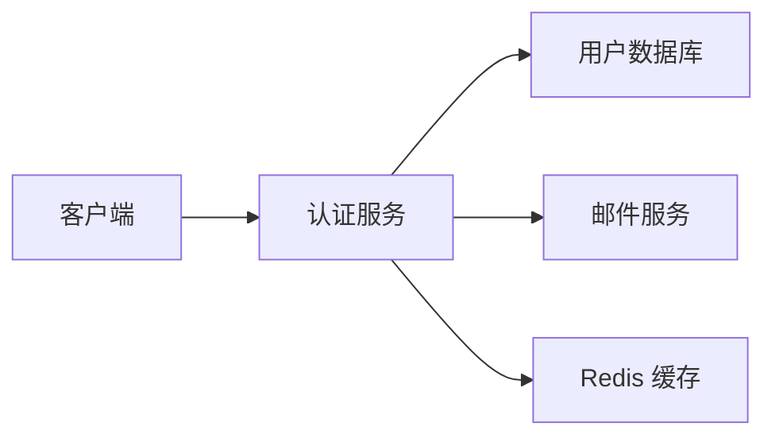
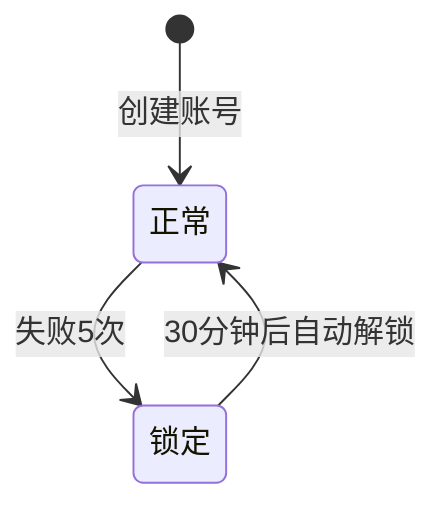

# 技术方案：[功能名称]

**功能分支**：`[功能名称-简写]`
**创建日期**：[DATE]
**版本**：v1.0
**PRD 来源**：`specs/[功能名称-简写]/prd.md`
**负责人**：[架构师/Tech Lead]

---

## 技术背景

> 简述本功能在系统中的位置，以及技术层面需要解决的核心问题。

[例：用户认证模块是整个平台的安全基础。当前系统没有认证机制，需要从零实现 JWT 无状态认证，支持登录失败次数限制和邮件通知。]

**技术背景 Checklist**：
- [ ] 与 PRD 中所有 AC 逐一对应确认
- [ ] 明确使用的技术栈（语言/框架版本）
- [ ] 明确存储方案（数据库类型）
- [ ] 明确部署目标（服务器/容器/Serverless）

---

## 架构概览

> 用 Mermaid 图描述模块关系或请求流。



**架构说明**：
- [模块1]：负责 [职责]
- [模块2]：负责 [职责]

---

## 数据模型

> 描述核心数据实体、字段类型和约束。不包含具体 SQL 语句，聚焦结构设计。

### 实体：[实体名称]

| 字段名 | 类型 | 约束 | 说明 |
|---|---|---|---|
| id | UUID | 主键，自动生成 | 唯一标识 |
| email | varchar(255) | 唯一，非空 | 用户邮箱 |
| password_hash | varchar(255) | 非空 | 密码哈希值（bcrypt） |
| login_fail_count | int | 默认 0 | 连续失败次数 |
| locked_until | timestamp | 可空 | 账号锁定截止时间 |
| created_at | timestamp | 非空，自动生成 | 创建时间 |

**状态流转（如有）**：



---

## 接口合约（API Contracts）

> 描述对外暴露的接口。保持技术中立，不依赖具体框架语法。

### 接口 1：用户登录

| 属性 | 说明 |
|---|---|
| 路径 | `POST /api/auth/login` |
| 认证 | 无需认证 |
| 限流 | 每 IP 每分钟 10 次 |

**请求体**：
```json
{
  "email": "user@example.com",
  "password": "明文密码"
}
```

**成功响应（200）**：
```json
{
  "token": "JWT字符串",
  "expires_at": "2026-04-01T00:00:00Z",
  "user_id": "uuid"
}
```

**错误响应**：
| HTTP 状态码 | 错误码 | 说明 |
|---|---|---|
| 401 | AUTH_INVALID | 账号或密码错误 |
| 423 | AUTH_LOCKED | 账号已锁定，返回解锁时间 |
| 429 | AUTH_RATE_LIMIT | 频率超限 |

---

### 接口 2：[接口名称]
[按需添加更多接口]

---

## 架构决策记录（ADR）

### ADR-01：[决策主题]

| 属性 | 说明 |
|---|---|
| **决策** | [例：使用 JWT 无状态认证，而非 Session] |
| **背景** | [例：系统需要支持多服务器部署，无状态方案更易扩展] |
| **备选方案** | [例：Session + Redis；Cookie-based] |
| **决策理由** | [例：JWT 无需服务器存储状态，水平扩展成本低；Session 需要共享存储] |
| **权衡取舍** | [例：Token 无法主动注销（已通过短过期时间 + Refresh Token 机制缓解）] |

---

## 技术风险

| 风险 | 可能性 | 影响 | 缓解措施 |
|---|---|---|---|
| 🔴 高 | [例：密码哈希计算耗时高，高并发下性能瓶颈] | 高 | 异步处理 + 压测验证 |
| 🟠 中 | [例：邮件服务不可用时锁定通知无法发送] | 中 | 异步队列重试，失败不阻断登录流程 |
| 🟡 低 | [例：JWT 密钥泄露] | 高 | 密钥存入 Secrets，定期轮换策略 |

---

## 实施阶段建议

> 给项目经理的任务拆分参考，不包含具体 Task 列表（由 proj.tasks 生成）。

| 阶段 | 内容 | 建议顺序 |
|---|---|---|
| 阶段一：基础设施 | 数据库 Schema、认证中间件骨架 | 最先 |
| 阶段二：核心功能 | 登录接口、密码验证、JWT 签发 | US-01 对应 |
| 阶段三：安全增强 | 失败计数、账号锁定、邮件通知 | US-01 AC-02 对应 |
| 阶段四：扩展功能 | 记住登录状态 | US-02 对应 |
| 阶段五：收尾 | 集成测试、文档、性能验证 | 最后 |

---

## 非功能需求验证

> 对 PRD 中约束项的技术落地方案确认。

| 约束 | 来自 PRD | 技术方案 |
|---|---|---|
| 密码不得明文存储 | AC-02 约束 | bcrypt 哈希，cost factor = 12 |
| 支持移动端 | 约束 | 无状态 JWT，前端自行存储 token |
| [其他约束] | | |
